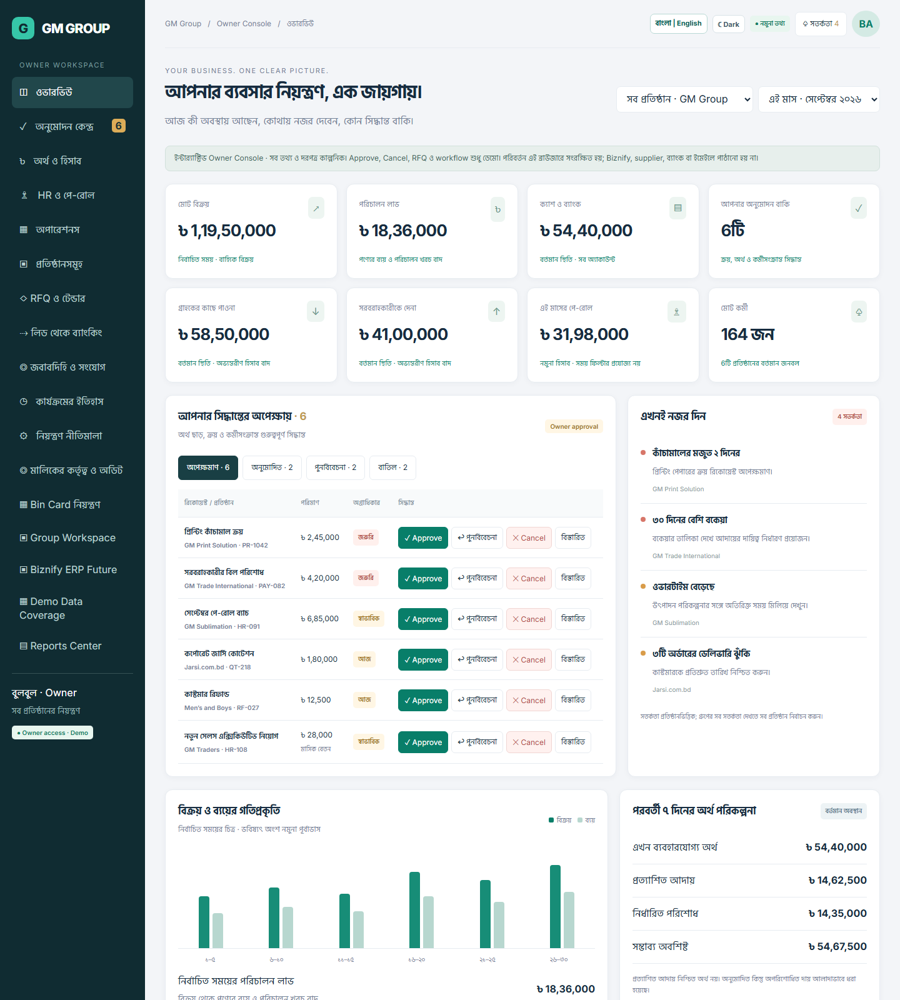
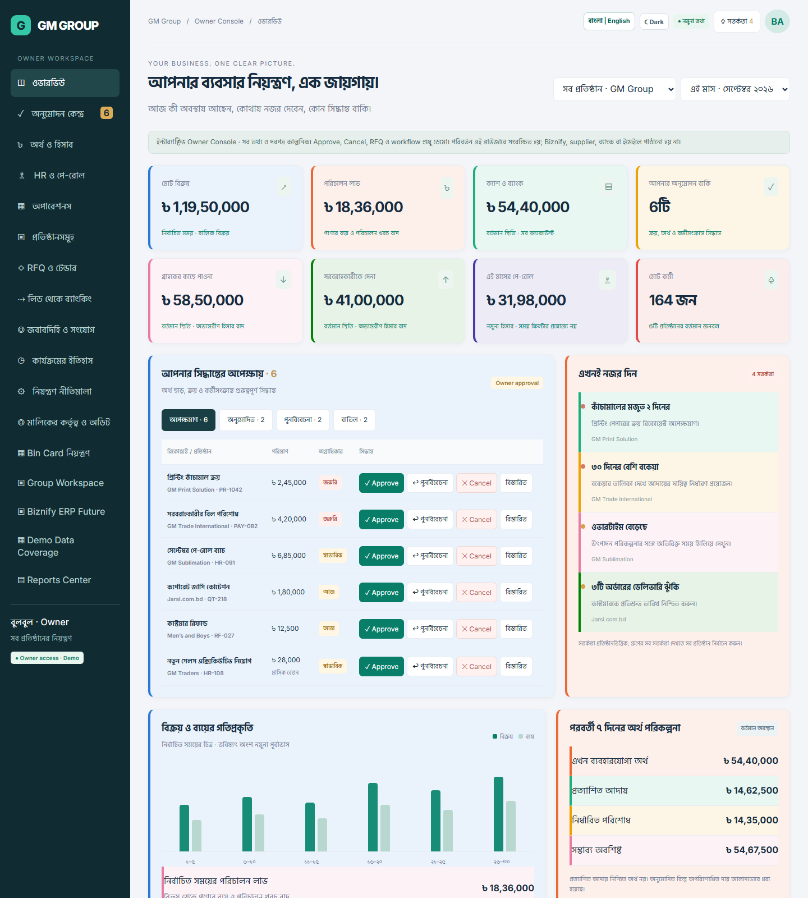
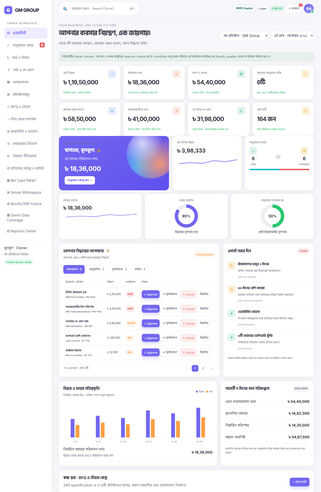

# GM Group · Owner Dashboard

An interactive, single-file HTML prototype of an owner-facing business
control panel for **GM Group** — approvals, finance, HR, procurement (RFQ),
production, RFQ/tender, bin card tracking, and reporting, all in one
dashboard. All data is fictional demo data; nothing here connects to a real
backend, bank, or ERP.

Three versions ship in this repo, each a **complete, standalone HTML file**
with no build step and no dependencies — just open it in a browser.

| File | Description |
|---|---|
| [`index.html`](index.html) | The original dashboard design (dark sidebar, teal accent). |
| [`index1.html`](index1.html) | A colorful variant — every card/tile gets a distinct accent color, using an accessibility-validated categorical palette. |
| [`index2.html`](index2.html) | A modern admin-template redesign (purple accent, hero widgets, sparkline/donut/ring charts, pagination) modeled after the reference dashboards in [`docs/`](docs). |

## Screenshots

**`index.html`** — original design



**`index1.html`** — colorful variant



**`index2.html`** — modern redesign with hero widgets and pagination



## Features

- **Owner approval center** — approve, cancel, or send back purchase/payment/HR
  requests, with a full decision history (before/after log).
- **Finance overview** — sales/expense trend chart, 7-day cash plan, KPI tiles.
- **Companies / Group Workspace** — per-company sales, profit, cash, and
  receivable/payable, with drill-down.
- **HR & Payroll**, **Operations** (procurement, inventory, sales/delivery)
  summaries.
- **RFQ & Tender center** — sealed-bid style supplier comparison and award flow.
- **Lead-to-banking workflow board** — a 13-stage pipeline view with per-job
  detail and stage transitions.
- **Bin Card control** — section-by-section production/delivery tracking with
  quantity-balance checks.
- **Owner Command Board** — production line status, scrap/recycling ledger,
  notifications, and a before/after change log.
- **Reports Center** — 21 mapped report types (P&L, cash flow, aging, QC
  reject, payroll, etc.).
- Bengali/English UI, light/dark theme toggle, and (in `index2.html`) a live
  search over the approvals list.
- All list/table views paginate automatically once they have more rows than
  fit on one page (`index2.html`).

## Getting started

No install, no build — just open a file in a browser:

```bash
git clone https://github.com/tahajjat/gm-owner-dashboard.git
cd gm-owner-dashboard
# then open index.html, index1.html, or index2.html directly in your browser
```

Or serve it locally if you prefer (optional, only needed for some browsers'
local-file security restrictions):

```bash
npx serve .
# or: python -m http.server 8080
```

## Tech notes

- Pure HTML/CSS/JavaScript — no framework, no bundler, no npm dependencies.
- State is kept in memory and persisted to `localStorage` per browser tab;
  nothing is sent to a server.
- Decision/notification sound uses the Web Audio API; charts are hand-rolled
  with inline SVG/CSS (conic-gradient donuts, `<polyline>` sparklines).

## Project docs

- [`docs/BROWSER-FREEZE-FIX.md`](docs/BROWSER-FREEZE-FIX.md) — root-cause
  writeup for two bugs that were found and fixed in `index.html`: a runaway
  `MutationObserver` that froze the tab, and a CSS layout bug that pushed
  several sections under the sidebar.
- [`docs/dashboard-sample-01.png`](docs/dashboard-sample-01.png) through
  `dashboard-sample-06.png` — the reference admin-dashboard screenshots that
  `index2.html`'s visual design was modeled after.

## Known limitations

This is a **design/UX prototype**, not a production app:

- No authentication beyond a decorative demo login gate.
- No real integrations (Biznify, Workify, Trello, banking) — those sections
  are explicitly labeled as demo/future in the UI.
- No automated tests.

## License

MIT — see [`LICENSE`](LICENSE). You're free to use, modify, and reuse this
code; just keep the copyright notice.
